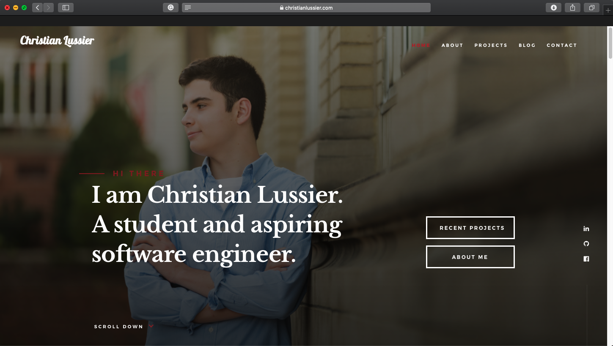

# Christian Lussier's Personal Website -- https://christianlussier.com
The files for work-in progress personal website of Christian Lussier.

## Development Process
I developed this website by using a free template. A link to the designer of this template can be found in the footer of the website. I then customized the template by adding information about myself to the website. I also removed unneeded features.

## Navigating the Files
The main directory of the website's repository holds a variety of files and folders. The main directory holds files such as the `index.html` file, which is the website's main file, the `styles.html` file, and other HTML files for the blog. The folder `css` contains the `.css` files that serve as the website's stylesheet. There is also the `fonts` folder that contains sub-folders that contain the content needed for the different fonts used in the website. The `images` file contains a variety of images and folders, containing more images, that are used throughout the website. The `inc` folder contains a `.php` file that is used as the form for the contact section of the website. The `js` folder contains the JavaScript files used as apart of the website. The `dls` folder contains the viewable and downloadable files available on the website. The only current file in this folder is that of my résumé.

## Issues, Feature Ideas, or Concerns?
If you notice any issues, bugs, have ideas about new features for the website, or anything else please let me know. Don't hesitate to leave in issue in the `Issues` tab of this repository or contact me at lussierc@allegheny.edu.

## Installation
You can access the files of this website locally either by downloading the repository or by using GitHub commands to clone it.

## Usage -- Accessing the Website
To access the website, there are two main ways this can be done. The easiest way to do this would be to access the website from your internet browser, using this link to access [My Personal Website](https://christianlussier.com). You can also clone or download this repository and open the website locally.

## Plans
This website is currently a work in progress. As a result in the near future I plan to add more content to the website and continue to fine tune it. Most of this content will be located on the index page and includes more of my projects, more blog posts and a link to a dedicated blog page, and a working contact form. If you have  ideas about what I could add to this website please leave an issue in the issue tracker. I would really appreciate it.

## Current Results
Though the website is currently a work in progress it functions as intended. It is both desktop and mobile ready.

Here is an example of the desktop version running in Safari:

Here is an example of the mobile version of the website in action:

